  <picture>
    <source media="(max-width: 760px) and (prefers-color-scheme: dark)" srcset="./assets/hero/agent-console-11b0cc90-mobile-dark.svg">
    <source media="(max-width: 760px)" srcset="./assets/hero/agent-console-11b0cc90-mobile-light.svg">
    <source media="(prefers-color-scheme: dark)" srcset="./assets/hero/agent-console-11b0cc90-dark.svg">
    <source media="(prefers-color-scheme: light)" srcset="./assets/hero/agent-console-11b0cc90-light.svg">
    
  </picture>

## Hey, I'm TajimeRose

I'm a **developer & freeland builder** based in Thailand. I work across **web development, AI, automation, and backend systems**, learning constantly and building software that pushes my skills forward.

I enjoy taking projects from an early idea to a working release: understanding the problem, building the core system, testing the final flow, and learning along the way.

## What I Build

- **Full-stack web development:** from frontend interfaces with modern frameworks to backend systems, APIs, and deployment.
- **AI & automation:** practical AI applications, intelligent workflows, and automation that makes software more efficient.
- **Backend & database systems:** scalable server architecture, database design with PostgreSQL and MongoDB, and reliable data-driven applications.
- **Developer tools:** tools and workflows that help developers build, test, and ship better software faster.

## Selected Work

| Project | What I built | My role · Current state |
| --- | --- | --- |
| [**NongPlatoo.Ai**](https://github.com/TajimeRose/profile) | An AI-themed web project built with HTML, CSS, and JavaScript — a practical exploration of AI concepts in a frontend interface. | Developer · Building |

## What I'm Exploring

I'm interested in building practical systems that combine modern web development, automation, and AI. My goal is to understand how software can become smarter, more efficient, and more accessible while keeping me at the cutting edge of technology.

Building prototypes and projects is how I test those ideas in practice.

# Contact

  

  

  

---

# Tech Stack

## Programming Languages

---

## Frontend Development

---

## Backend Development

---

## Database

---

## AI & Automation

---

## Cloud & DevOps

---

## Development Tools

`

<strong>Recent public activity</strong>

 

<!-- AUTO:ACTIVITY:START -->
_Recent public activity will appear here after the workflow runs._
<!-- AUTO:ACTIVITY:END -->

---

  Building skills, learning constantly, and sharing what I create.

